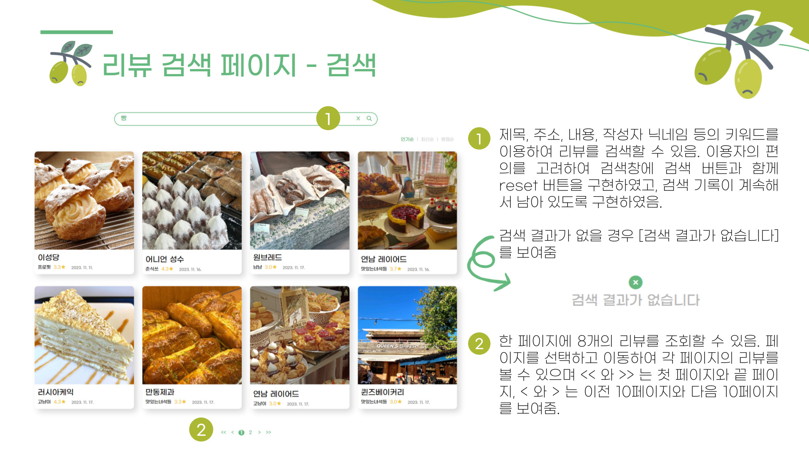
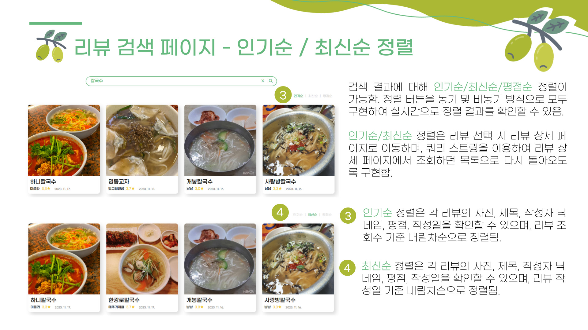
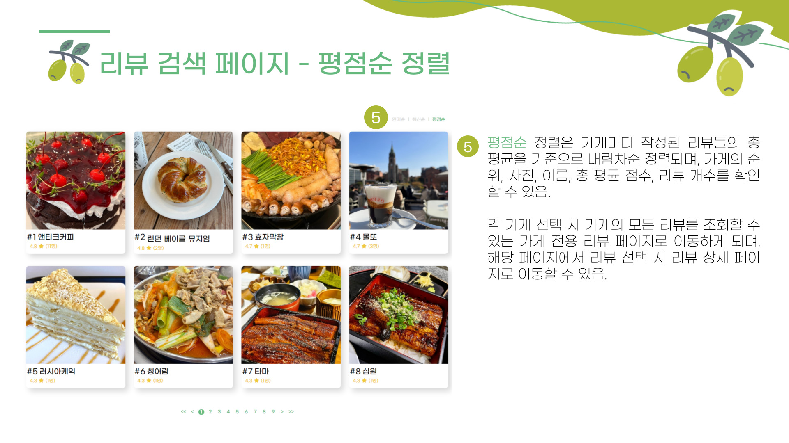
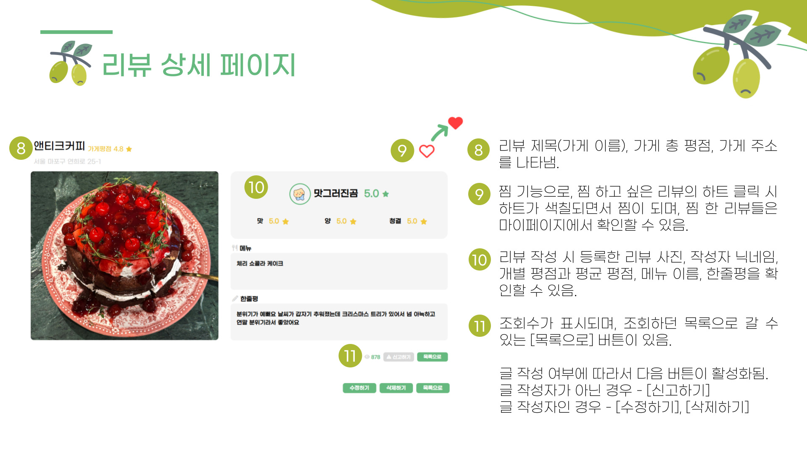
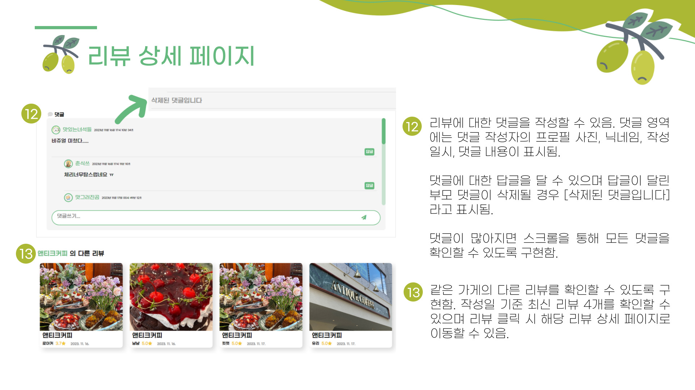

> # Oliview 프로젝트 담당기능 - 리뷰게시판📝(정유진)
 - 리뷰 검색 및 목록 조회
 - 리뷰 인기순 / 최신순 / 평점순 정렬
 - 리뷰 게시글 상세 조회(+ 댓글 작성, 찜, 신고, 다른 리뷰 미리보기 기능)

 
 

> ## 리뷰 검색 및 목록 조회

 
 
#### 🔽 '칼국수' / '서울' / 'ㅇㅇ'(검색 결과x) 검색

 
 
 
 

> ## 리뷰 인기순 / 최신순 / 평점순 정렬
- 인기순, 최신순 정렬

 
 
#### 🔽 '빵' 검색하여 인기순 / 최신순 정렬

 
 

- 평점순 정렬

 
 
#### 🔽 평점순 정렬 및 가게 상세 페이지 조회

 
 
 
 

> ## 리뷰 게시글 상세 조회

 
 
#### 🔽 리뷰 상세 페이지 조회

###### 1. 내가 쓴 리뷰('후니도니') 조회 : 수정하기, 삭제하기, 목록으로 버튼 기능
###### 2. 다른 사람이 쓴 리뷰('런던 베이글 뮤지엄') 조회 : 찜 기능 / 신고하기, 목록으로 버튼 기능 / 댓글 등록, 수정, 삭제, 대댓글 등록 / 다른 리뷰 이동

 
 
 
 
