> # conBee 프로젝트 담당기능 - 전자결재 기안파트📝(정유진)
 - 기안문 작성
 - 임시저장함
 - 결재요청함
 - 회수문서함

 
 

> ## 전자결재 흐름도
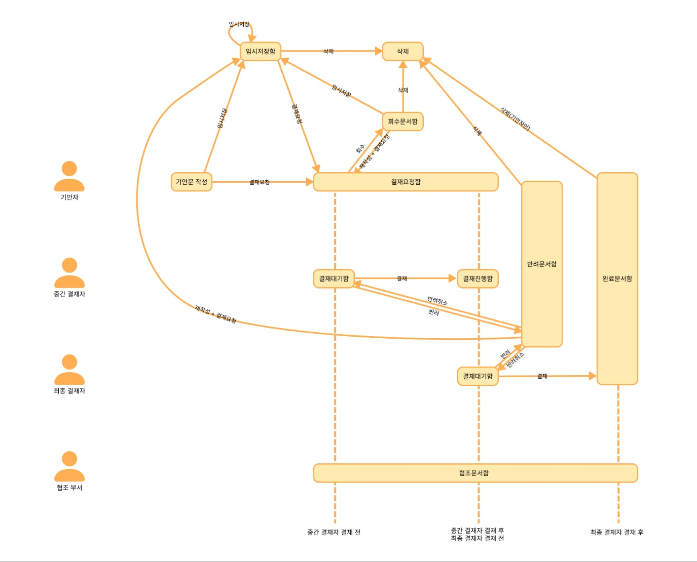

 
 

> ## 기안문 작성
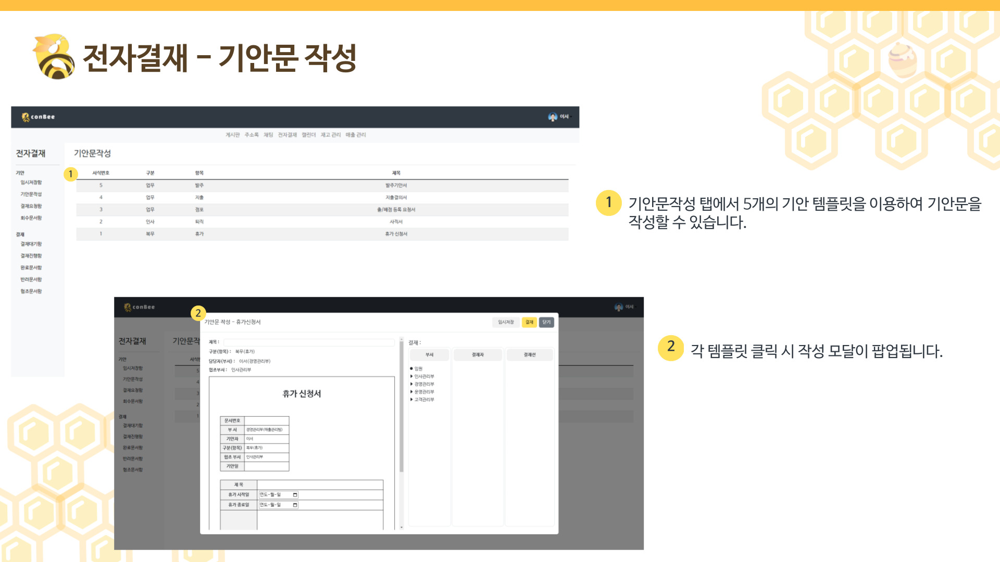
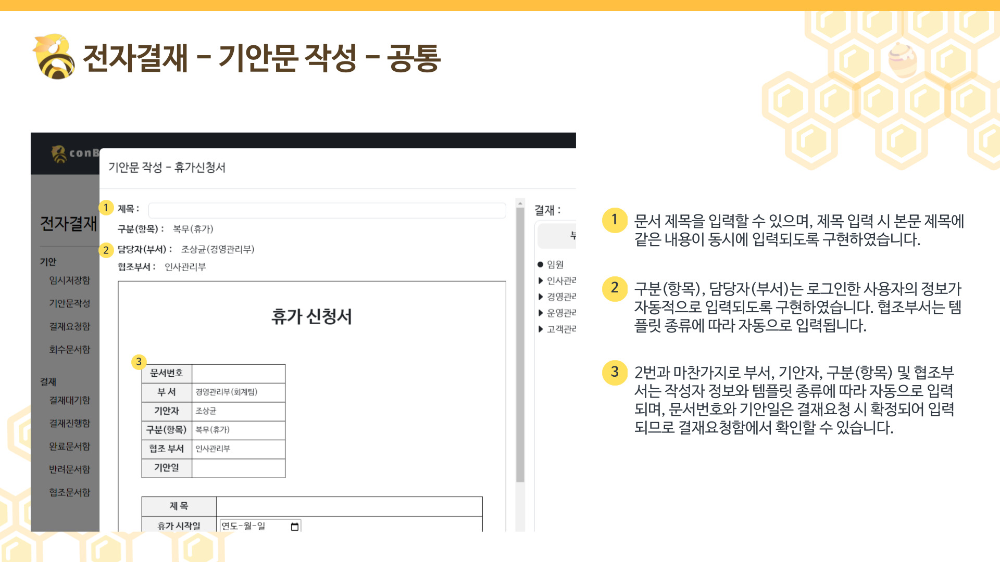

 

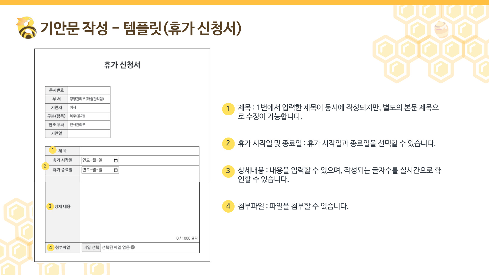
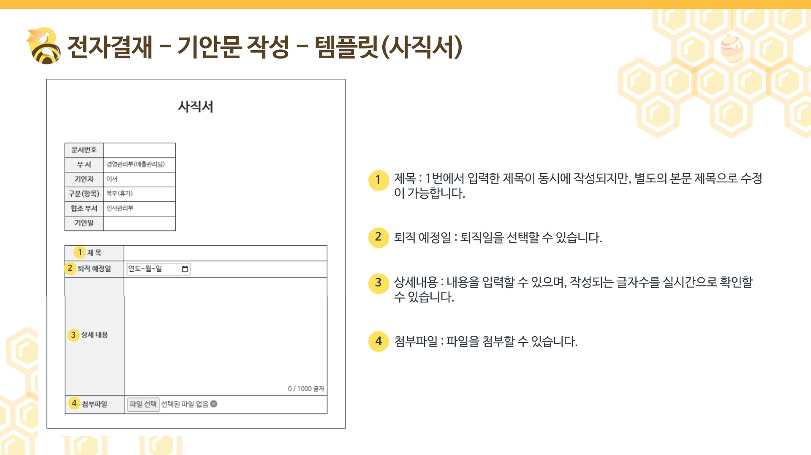
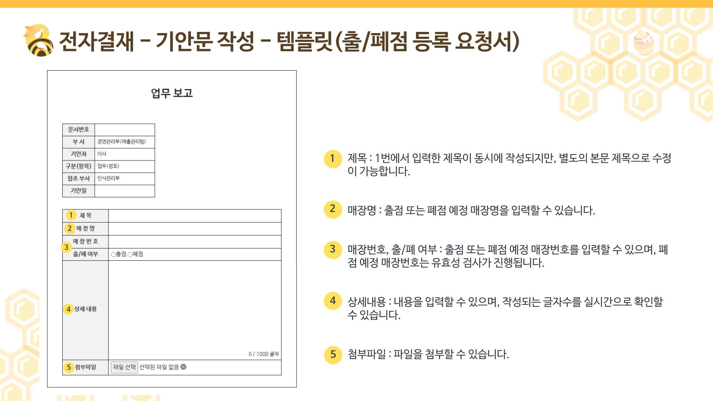
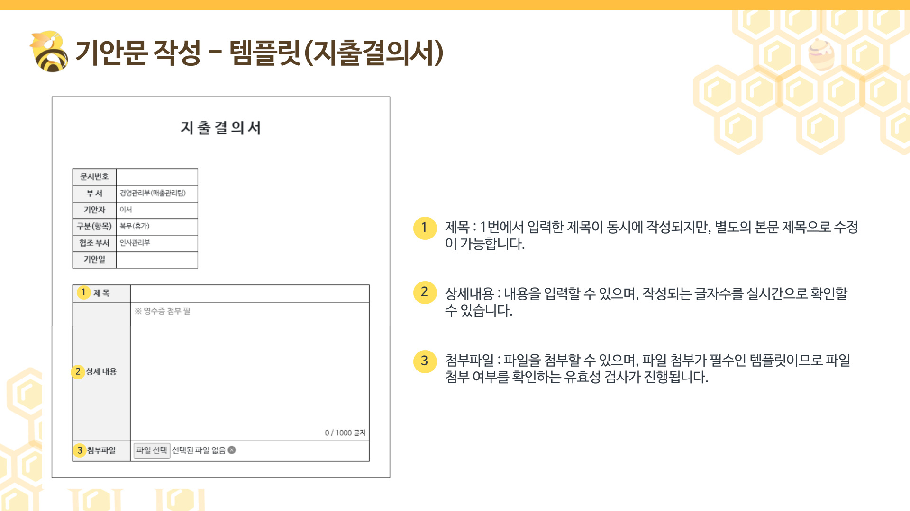
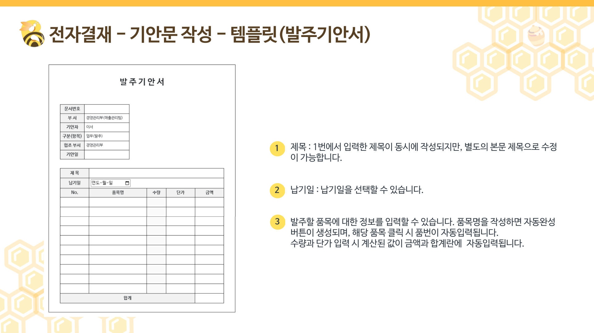

 

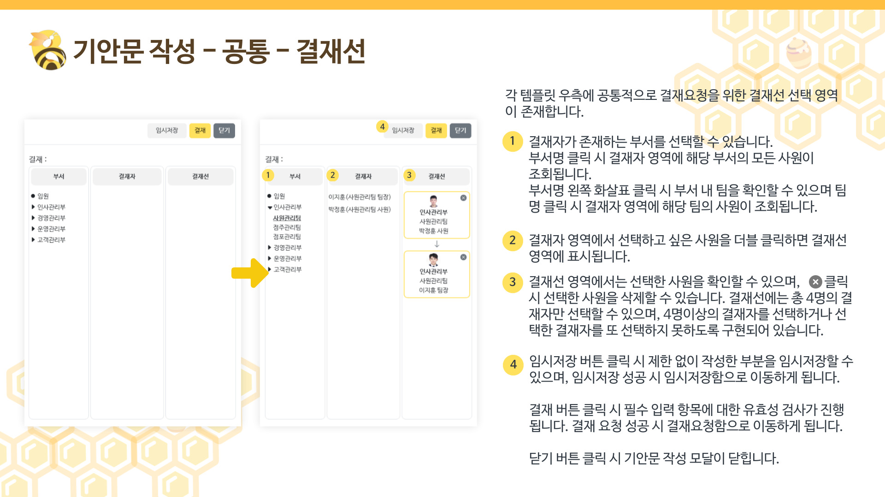

 
 
### 🔽 <휴가> 기안 작성 화면

###### 1. 전자결재-> 기안문 작성 탭에서 휴가신청서 클릭
###### 2. 휴가신청서 기안 작성 : 제목 및 내용 작성(제목 유효성 검사), 날짜선택, 파일 첨부 
###### 3. 결재선 추가 : 유효성 검사 (동일한 결재자 추가 불가 / 4명까지 추가 가능)
###### 4. 결재 요청 후 결재요청함에서 작성문서 확인 가능

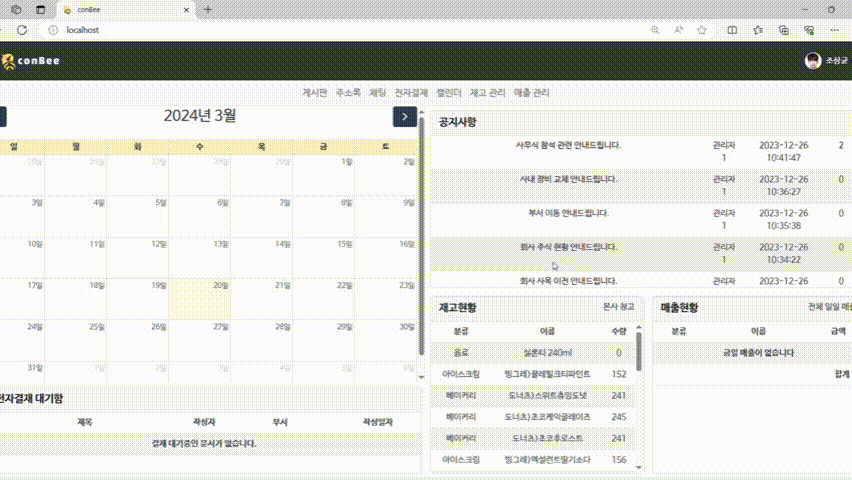

 
 

> ## 임시저장함
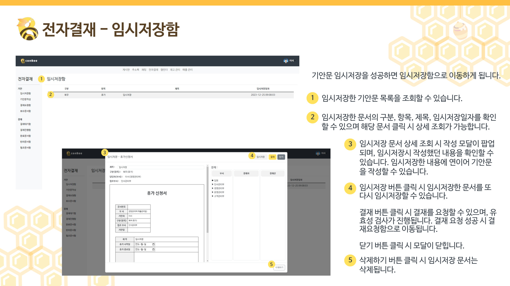

 
 

> ## 결재요청함

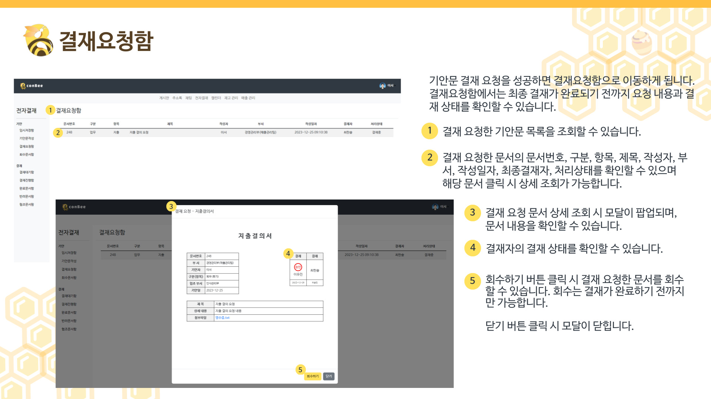

 
 

> ## 회수문서함

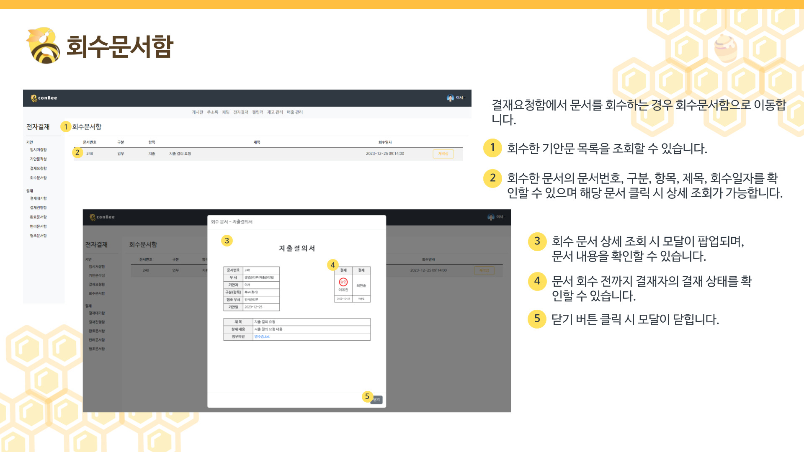
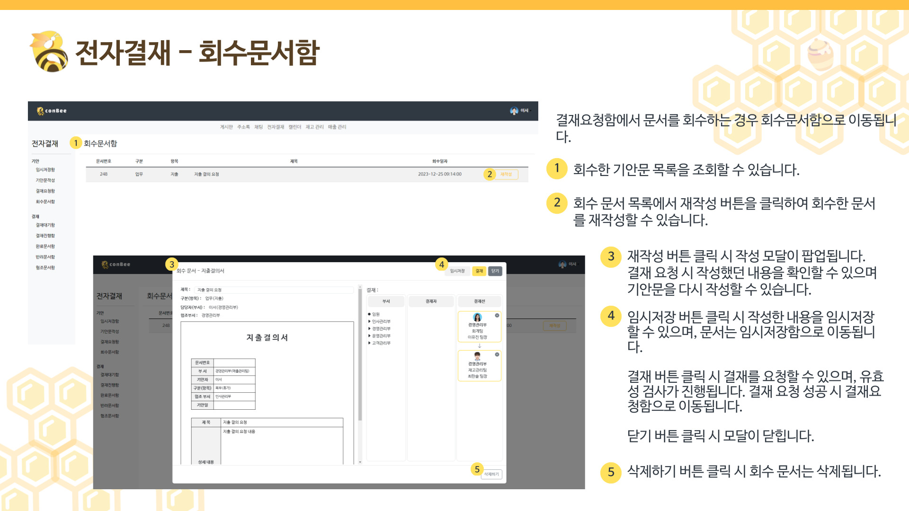

 
 
 
 

