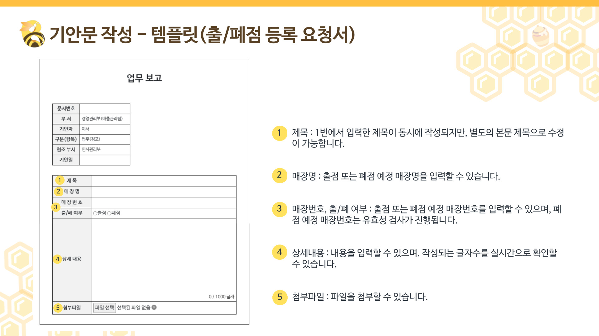
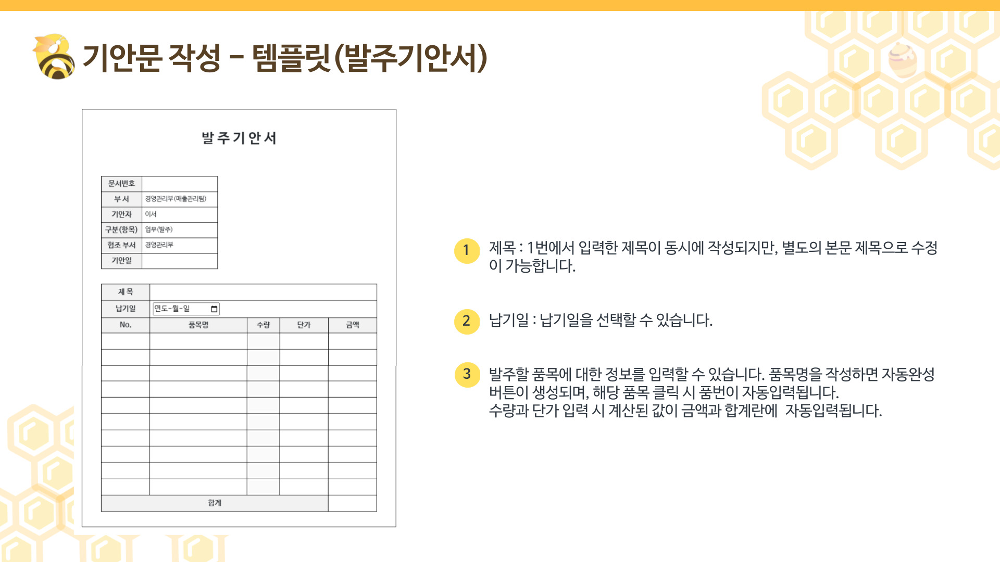
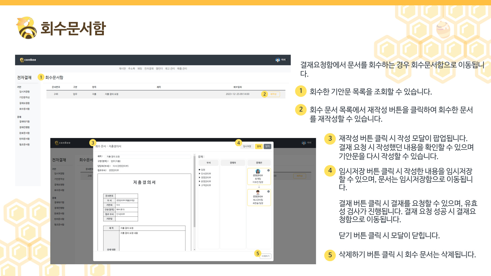

> # conBee 프로젝트 담당기능 - 전자결재 기안파트📝(정유진)
 - 기안문 작성
 - 임시저장함
 - 결재요청함
 - 회수문서함

 
 

> ## 전자결재 흐름도

 
 

> ## 기안문 작성

 

 

 
 
### 🔽 <휴가> 기안 작성 화면

 
 

> ## 임시저장함

 
 

> ## 결재요청함

 
 

> ## 회수문서함

 
 
 
 

